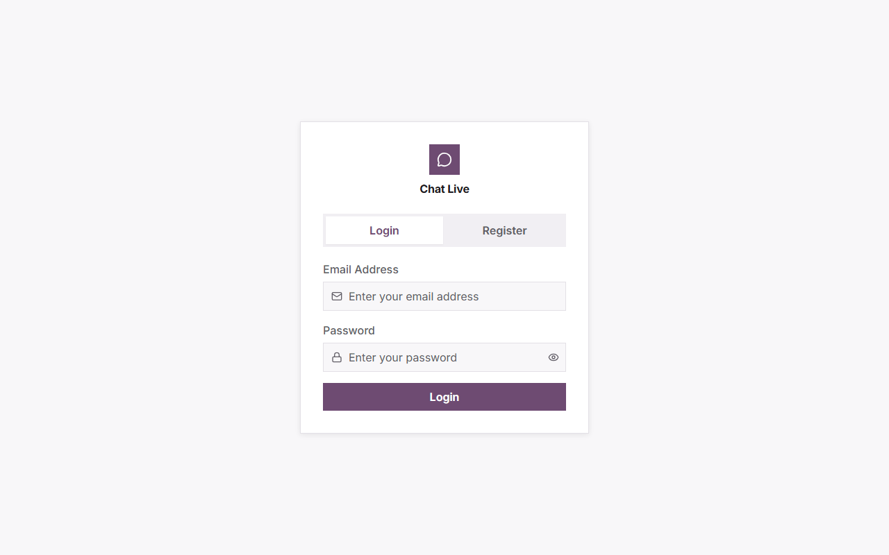
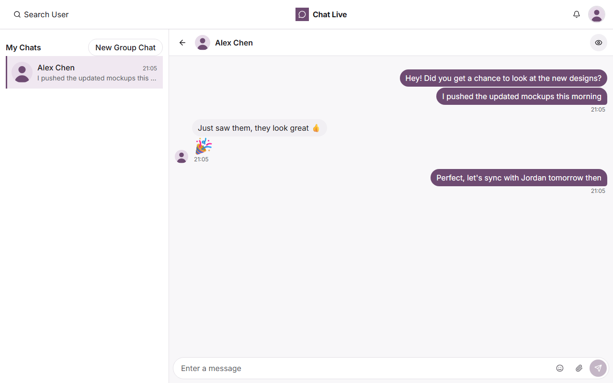
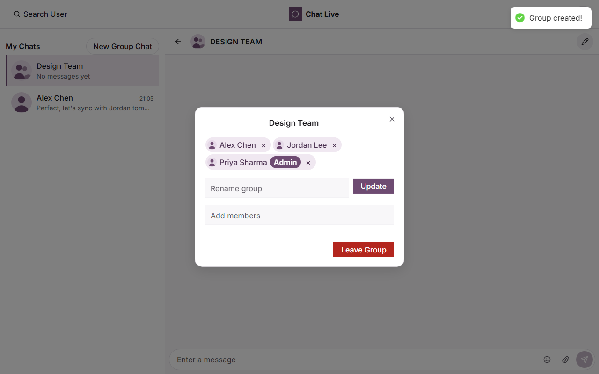

# Chat Live

A real-time messaging application built with the MERN stack and Socket.io. One-to-one and group conversations, emoji, image/video/file sharing, typing indicators, unread-message notifications, and a light/dark theme with a custom design system.

**Live demo:** https://chat-live-qziv.onrender.com
_(hosted on Render's free tier, so the first request may take ~30s to wake the server)_

---

## Screenshots

| Login | Conversation | Group management |
| ----- | ------------ | ---------------- |
|  |  |  |

---

## Features

- **Real-time messaging** over Socket.io with an authenticated handshake, fanned out server-side so a client can never forge what a recipient sees
- **One-to-one and group chats**, with admin-controlled membership — adding someone or creating a group notifies them immediately, not just once a message is sent
- **Emoji picker**, with emoji-only messages rendered large and bubble-free
- **Image, video, and file sharing** via Cloudinary — drag-drop upload with a live preview and progress bar, client-side size guards, image lightbox, video poster frames
- **Typing indicators** and **unread-message notifications**
- **JWT authentication** with bcrypt-hashed passwords
- **Light and dark themes**, persisted across sessions, driven by a single `data-theme` mechanism
- **Responsive layout** that collapses to a single pane on mobile
- **A real design system** — Tailwind v4 tokens (color, type, spacing, elevation) and themed Radix UI primitives (dialogs, dropdowns, popovers) instead of a component library

## Tech stack

| Layer     | Technology                                                        |
| --------- | ------------------------------------------------------------------ |
| Frontend  | React 18, Vite, React Router 6, Tailwind v4, Radix UI primitives, Sass |
| Realtime  | Socket.io                                                           |
| Backend   | Node.js, Express 4                                                  |
| Database  | MongoDB with Mongoose                                               |
| Auth      | JSON Web Tokens, bcryptjs                                           |
| Uploads   | Cloudinary (image / video / raw)                                    |
| Icons     | lucide-react                                                        |
| Emoji     | emoji-picker-react, lazy-loaded                                     |
| Testing   | Vitest, Supertest, mongodb-memory-server                            |

---

## Architecture

```
┌─────────────────┐         HTTP /api/*          ┌──────────────────┐
│                 │ ───────────────────────────► │                  │
│  React (Vite)   │                              │  Express server  │
│                 │ ◄─────────────────────────── │                  │
│  ChatProvider   │         JSON responses       │  protect ──┐     │
│  SocketProvider │                              │            ▼     │
│                 │      WebSocket (Socket.io)   │  chatAccess      │
│                 │ ◄──────────────────────────► │            │     │
└─────────────────┘   authenticated handshake    └────────────┼─────┘
                                                              ▼
                                                       ┌────────────┐
                                                       │  MongoDB   │
                                                       │  users     │
                                                       │  chats     │
                                                       │  messages  │
                                                       └────────────┘
```

Two middleware layers guard every request. `protect` verifies the JWT and
establishes *who* the caller is; `chatAccess` establishes whether they may
touch *this particular* chat. Socket connections are authenticated at the
handshake, and message fan-out reads its recipient list from the database
rather than from the client's payload.

---

## Getting started

### Prerequisites

- Node.js 20 or later
- Docker (for the local MongoDB), or a MongoDB connection string of your own

### Setup

```bash
git clone https://github.com/mittens67/chat-live.git
cd chat-live

# 1. Start MongoDB
docker compose up -d

# 2. Configure the server
cp .env.example .env
#    then set JWT_SECRET — generate one with:
#    openssl rand -hex 32

# 3. Configure the client
cp client/.env.example client/.env

# 4. Install dependencies
npm install
npm install --prefix client

# 5. Run it (two terminals)
npm run dev          # API on :3000
npm run dev:client   # UI on :5173
```

Open http://localhost:5173 and register an account.

To see messaging work end to end, register a second user in a private window
and start a chat between them.

### Environment variables

**Server** (`.env`)

| Variable                | Required | Description                                                                                     |
| ----------------------- | -------- | ------------------------------------------------------------------------------------------------- |
| `MONGO_URI`             | yes      | MongoDB connection string                                                                          |
| `JWT_SECRET`            | yes      | Secret for signing JWTs; at least 32 characters                                                    |
| `PORT`                  | no       | API port (default `3000`)                                                                          |
| `NODE_ENV`              | no       | `development`, `production`, or `test`                                                             |
| `CORS_ORIGIN`           | no       | Allowed origin in development (default `localhost:5173`)                                           |
| `CLOUDINARY_CLOUD_NAME` | no       | Same cloud name as the client's `VITE_CLOUDINARY_CLOUD_NAME` — not a secret. Used to verify an attachment URL actually points at your own Cloudinary account before it's stored and broadcast. Leave unset and attachments are refused; everything else works. |

**Client** (`client/.env`) — these are bundled into the browser build, so never
put a secret here.

| Variable                        | Required | Description                                                |
| ------------------------------- | -------- | ---------------------------------------------------------- |
| `VITE_SOCKET_URL`               | no       | Socket.io origin; leave blank for same-origin (the default) |
| `VITE_CLOUDINARY_CLOUD_NAME`    | no       | Cloudinary cloud name; attachments are disabled without it  |
| `VITE_CLOUDINARY_UPLOAD_PRESET` | no       | Cloudinary unsigned upload preset                           |

The Vite dev server proxies both `/api` and `/socket.io` to the API on port
3000, so the client works same-origin in development exactly as it does in
production — no environment-specific URLs to switch between.

The server refuses to start if a required variable is missing, rather than
failing later at the first login.

---

## Scripts

| Command               | What it does                                  |
| --------------------- | --------------------------------------------- |
| `npm run dev`         | Start the API with nodemon                    |
| `npm run dev:client`  | Start the Vite dev server                     |
| `npm start`           | Start the API for production                  |
| `npm test`            | Run the server test suite                     |
| `npm run lint`        | Lint the server                               |
| `npm run lint:client` | Lint the client                               |
| `npm run build`       | Install client deps and build for production  |

## Testing

```bash
npm test
```

The suite runs against an in-memory MongoDB, so no running database is needed.
Coverage focuses on authentication and authorization — that every route
correctly refuses a caller who is not a member of the chat, and that password
hashes never appear in a response.

---

## API

All `/api/chat` and `/api/message` routes require an
`Authorization: Bearer <token>` header.

| Method | Endpoint                | Access        | Description                       |
| ------ | ----------------------- | ------------- | --------------------------------- |
| POST   | `/api/user`             | Public        | Register                          |
| POST   | `/api/user/login`       | Public        | Log in                            |
| GET    | `/api/user?search=`     | Authenticated | Search users                      |
| POST   | `/api/chat`             | Authenticated | Create or fetch a one-to-one chat |
| GET    | `/api/chat`             | Authenticated | List your chats                   |
| POST   | `/api/chat/group`       | Authenticated | Create a group chat               |
| PUT    | `/api/chat/rename`      | Group admin   | Rename a group                    |
| PUT    | `/api/chat/groupadd`    | Group admin   | Add a member                      |
| PUT    | `/api/chat/groupremove` | Admin or self | Remove a member, or leave         |
| GET    | `/api/message/:chatId`  | Chat member   | Fetch a chat's messages           |
| POST   | `/api/message`          | Chat member   | Send a message                    |

### Socket events

The handshake requires a JWT: `io(url, { auth: { token } })`. The server joins
every connection to a room named for its own user id — the addressing
primitive every event below is built on — and never accepts a message payload
from a client; messages are only ever broadcast from the persisted document
after `POST /api/message` writes it, so a client cannot forge what a
recipient sees.

| Direction       | Event               | Payload                       |
| ---------------- | ------------------- | ------------------------------ |
| Server → client  | `connected`         | —                               |
| Client → server  | `join chat`         | `chatId`, acked `{ joined }`    |
| Server → client  | `message recieved`  | the persisted message           |
| Server → client  | `added to chat`     | the chat you were just added to |
| Client ↔ server  | `typing`            | `chatId` → `{ userId }`         |
| Client ↔ server  | `stop typing`       | `chatId` → `{ userId }`         |
| Server → client  | `presence:online`   | `{ userId }`                    |
| Server → client  | `presence:offline`  | `{ userId }`                    |
| Client → server  | `presence:list`     | `chatId`, acked `{ online: [userId] }` |

> `message recieved` is misspelled in the wire protocol. It is kept as-is for
> compatibility with the deployed client.
>
> Presence is tracked (a user's own room doubles as their online signal) but
> not yet surfaced anywhere in the UI — the wire protocol is ready for an
> online-status indicator, which just hasn't been built yet.

---

## Deployment

The app is deployed on Render as a single service: the Express server serves
the built React client from `client/dist` when `NODE_ENV=production`, so the
API and UI share an origin and no CORS configuration is required.

- **Build command:** `npm install && npm run build`
- **Start command:** `npm start`
- Set `MONGO_URI`, `JWT_SECRET`, and `NODE_ENV=production` in the dashboard.
- For attachments, also set `CLOUDINARY_CLOUD_NAME` (server) and both
  `VITE_CLOUDINARY_CLOUD_NAME` / `VITE_CLOUDINARY_UPLOAD_PRESET` (client) —
  the `VITE_*` ones are baked into the bundle at build time, so they must be
  set *before* the build command runs, not just at start.

## License

MIT — see [LICENSE](LICENSE).
